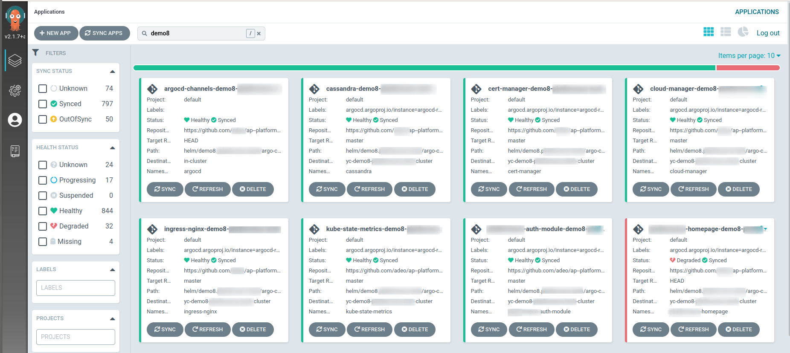

class: title, middle, center
<!-- css classes -->

# GitOps & Argo Stack

<!-- Notes -->
???
- gitops
- argostack
- argocd
- demo
- flux
- flagger

---
## Кто я
----

<h3>
<table>
  <tr>
    <td><span style="font-size: 1em;"><i class="fas fa-user fa-fw"></i></span></td>
    <td>Дмитрий Бубнов</td>
  </tr>
  <tr>
    <td><i class="fas fa-home fa-fw"></i></td>
    <td>Челябинск, Бишкек</td>
  </tr>
  <tr>
    <td><i class="fas fa-graduation-cap fa-fw"></i></td>
    <td>Тренер Mikrotik</td>
  </tr>
  <tr>
    <td><i class="fas fa-award fa-fw"></i></td>
    <td>Mikrotik Certified, CCNA R&S, AWS Certified Solutions Architect - Associate</td>
  </tr>
  <tr>
    <td><i class="fas fa-network-wired fa-fw"></i></td>
    <td>Сети</td>
  </tr>
  <tr>
    <td><i class="fas fa-chart-line fa-fw"></i></td>
    <td>DevOps</td>
  </tr>
</table>
</h3>

---


---
## <i class="fas fa-table fa-fw"></i> О чем будем говорить
----

- ### GitOps
- ### ArgoStack
- ### ArgoCD
- ### ArgoWorkflows
- ### Demo


---
##  GitOps
----
- Первое упоминание в 2017 в контексте Kubernetes и CD
- Равитие IaC
- Best practices from git to deploy, manage and monitoring

???
From [here](https://www.weave.works/technologies/gitops/)

---
##  GitOps
----
- Flux
- ArgoCD
## CNCF Incubating
---
##  ArgoStack
----
- ArgoCD
- ArgoWorkflow
- ArgoEvents
- ArgoRollouts

---
##  Resources
----
- Application
- Workflow / WorkflowTemplate / CronWorkflow
- Sensor / EventSource
- Rollout

---
##  ArgoCD
----

- Manual or automatic deployment of applications to a Kubernetes cluster
- Automatic synchronization of application state to the current version of declarative configuration
- Web user interface and command-line interface (CLI)
- Ability to visualize deployment issues, detect and remediate configuration drift
- Role-based access control (RBAC) enabling multi-cluster management
- Single sign-on (SSO) with providers such as GitLab, GitHub, Microsoft, OAuth2, OIDC, LinkedIn, LDAP, and SAML 2.0
- Support for webhooks triggering actions in GitLab, GitHub, and BitBucket
- Plugins

---
##  ArgoCD
----


---
##  ArgoCD
----


???
статусы ресурсов - аутофсинк
---
##  ArgoCD
----


---
##  ArgoCD
----


---
##  ArgoCD
----


---
##  ArgoCD
----


---
##  ArgoCD
----
### Deploy from:

- Kustomize applications
- Helm charts
- Ksonnet applications
- A directory of YAML/JSON/Jsonnet manifests, including Jsonnet.
- Any custom config management tool configured as a config management plugin


---
##  Application
----
```
apiVersion: argoproj.io/v1alpha1
kind: Application
metadata:
  name: prometheus-demo8
  namespace: argocd
spec:
  destination:
    name: 'yc-demo-cluster'
    namespace: prometheus
  source:                                                   # < App from chart
    chart: prometheus-community/kube-prometheus-stack
    repoURL: https://prometheus-community.github.io/helm-charts
    targetRevision: 35.2.0
    helm:
      releaseName: prometheus
  project: default
  syncPolicy:
    automated:
      prune: true
      selfHeal: true
    syncOptions:
      - CreateNamespace=true
```

---
##  Application
----
```
apiVersion: argoproj.io/v1alpha1
kind: Application
metadata:
  name: prometheus-demo8
  namespace: argocd
spec:
  destination:
    name: 'yc-demo-cluster'
    namespace: prometheus
  source:
    repoURL: 'https://github.com/REPONAME'
    path: helm/demo8.cluster/argo-cd/prometheus
    targetRevision: HEAD 
    helm:
      valueFiles:
      - values-ex.yaml                              # < Helm values
  project: default
  syncPolicy:
    automated:
      prune: true
      selfHeal: true
    syncOptions:
      - CreateNamespace=true
```
---
##  Application with Vault
----
[Argo CD Vault Plugin ](https://argocd-vault-plugin.readthedocs.io/en/stable/)
```
apiVersion: argoproj.io/v1alpha1
kind: Application
metadata:
  name: prometheus-demo8
  namespace: argocd
spec:
  destination:
    name: 'yc-demo-cluster'
    namespace: prometheus
  source:
    repoURL: 'https://github.com/REPONAME'
    path: helm/demo8.cluster/argo-cd/prometheus
    targetRevision: HEAD 
    plugin:
      name: argocd-vault-plugin-helm       # < Use plugin
      env:
      - name: HELM_RELEASE_NAME
        value: prometheus
      - name: helm_args
        value: -f values-ex.yaml 
  project: default
  syncPolicy:
    automated:
      prune: true
      selfHeal: true
    syncOptions:
      - CreateNamespace=true
```

---
##  Application wiith Vault
----

```
...
secret_id: <path:kv/path/secret#id>
...
```

---
##  ArgoWorkflows
----

- Define workflows where each step in the workflow is a container.
- Model multi-step workflows as a sequence of tasks or capture the dependencies between tasks using a graph (DAG).
- Easily run compute intensive jobs for machine learning or data processing in a fraction of the time using Argo Workflows on Kubernetes.
- Run CI/CD pipelines natively on Kubernetes without configuring complex software development products.

???
вопрос - Jenkins - GitLab?
---
##  ArgoWorkflows
----


---
##  ArgoWorkflows
----
```
apiVersion: argoproj.io/v1alpha1
kind: Workflow
metadata:
  generateName: hello-world-  # Name of this Workflow
spec:
  entrypoint: whalesay        # Defines "whalesay" as the "main" template
  templates:
  - name: whalesay            # Defining the "whalesay" template
    container:
      image: docker/whalesay
      command: [cowsay]
      args: ["hello world"]   # This template runs "cowsay" in the "whalesay" image with arguments "hello world"
```

---
##  ArgoWorkflows CI
----

[CI Workflow](https://github.com/argoproj/argo-workflows/blob/master/examples/ci-workflowtemplate.yaml)

---
##  ArgoWorkflows
----

```
- name: git
  inputs:
    artifacts:
      name: source
      path: /src
      git:                                  # < Git
        repo: https://github.com/repo
        depth: 1
        revision: master
        usernameSecret:
          name: github-creds
          key: user
        passwordSecret:
          name: github-creds
          key: password
  container:
    ...
```

---
##  ArgoWorkflows Artifacts
----
- Artifactory
- Archive
- S3 / GCS / OSS
- Git
- HDFS
- HTTP
- Raw
- From previous step


---
##  ArgoWorkflows with Vault
----
```
- name: vault-secrets
  metadata:
    annotations:
      # General Vault config
      vault.hashicorp.com/agent-inject: 'true'
      vault.hashicorp.com/agent-extra-secret: 'vault-agent-approle-id'
      vault.hashicorp.com/auth-type: 'approle'
      vault.hashicorp.com/auth-path: 'auth/approle/'
      vault.hashicorp.com/role: 'argocd'
      vault.hashicorp.com/namespace: argo
      vault.hashicorp.com/auth-config-role-id-file-path: '/vault/custom/role-id'
      vault.hashicorp.com/auth-config-secret-id-file-path: '/vault/custom/secret-id'
      #
      vault.hashicorp.com/secret-volume-path: "/tmp"                        # < Dir with secrets
      vault.hashicorp.com/agent-inject-secret-terraform-states-store: 'kv/s3/terraform-states-store'
      vault.hashicorp.com/agent-inject-template-terraform-states-store: |
        {{- with secret "kv/s3/terraform-states-store" -}}
        export AWS_ACCESS_KEY_ID={{ .Data.data.access_key }}
        export AWS_SECRET_ACCESS_KEY={{ .Data.data.secret_key }}
        {{- end }}
  script:
    source: |
      source /tmp/terraform-states-store
...
```

---
##  ArgoWorkflows with Vault
----
cat /tmp/terraform-states-store:
```bash
export AWS_ACCESS_KEY_ID=some_key
export AWS_SECRET_ACCESS_KEY=some_secret
```

[Creating an Argo Workflow With Vault Integration Using Helm](https://cloud.redhat.com/blog/creating-an-argo-workflow-with-vault-integration-using-helm)


---
## <i class="fas fa-info fa-fw"></i> Info

#### Workshops
-   [Katacoda ArgoWorkflow](https://www.katacoda.com/argoproj/courses/argo-workflows/)
-   [Katacoda ArgoCD](https://www.katacoda.com/vikas-poddar-slalom/scenarios/session-09-lab3-gitops-argocd)


#### Presentation
https://bubnovd.github.io/Pres_GitOps_ArgoCD/

#### Tools for presentation

-  [markdown](https://daringfireball.net/projects/markdown/)
-  [remark](https://github.com/gnab/remark)
-  [font-awesome](https://fontawesome.com/)
-  [Visual Studio Code](https://code.visualstudio.com/)
-  [hands](http://www.bubnovd.net)
---
## <i class="fas fa-hands-helping fa-fw"></i> Contacts
----

### <i class="fas fa-link fa-fw"></i> https://bubnovd.net
### <i class="fab fa-telegram-plane fa-fw"></i> @mikrotikninja
### <i class="fab fa-telegram-plane fa-fw"></i> @sysadminka
### <i class="fab fa-telegram-plane fa-fw"></i> @bubnov
----

### <i class="fab fa-facebook-f fa-fw"></i><i class="fab fa-vk fa-fw"></i><i class="fab fa-twitter fa-fw"></i><i class="fab fa-linkedin-in fa-fw"></i><i class="fab fa-instagram fa-fw"></i><i class="fab fa-github fa-fw"></i>: 
### \- mikrotikninja
### \- sysadminka
###  \- bubnov

